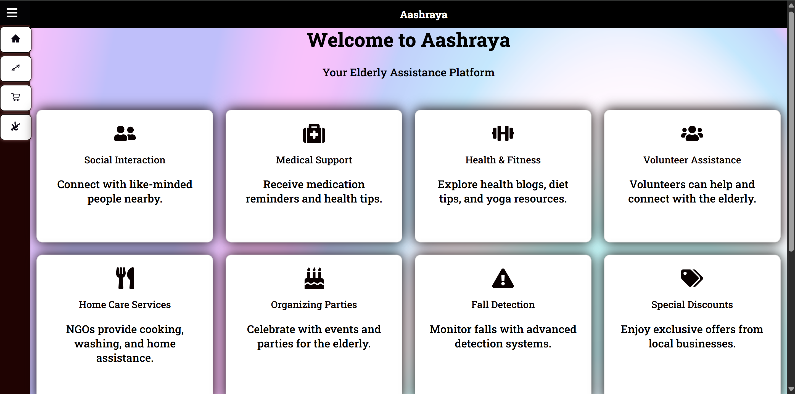
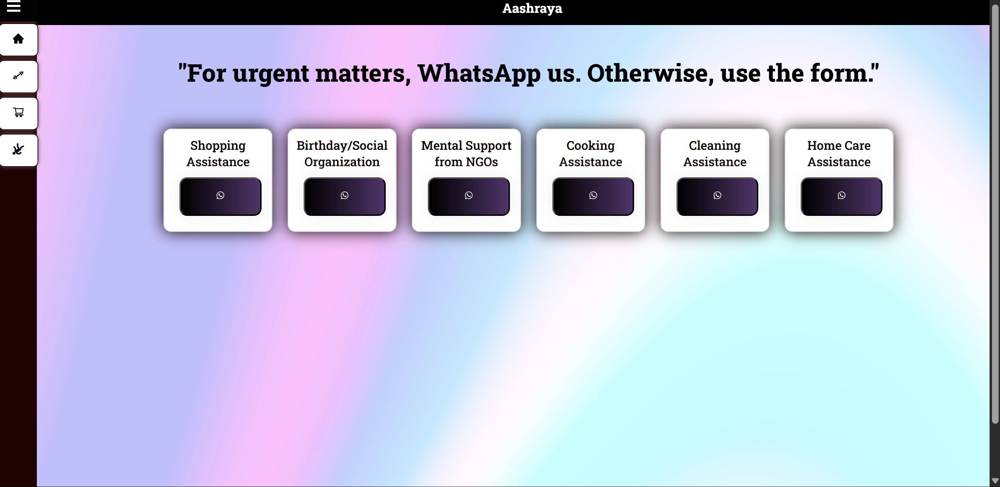

# Aashraya - Your Elderly Assistance Platform

Welcome to Aashraya, a web application dedicated to providing essential support and companionship to senior citizens. Aashraya leverages the power of technology to enhance the lives of the elderly by offering a range of valuable features and services.

## Table of Contents
- [Features](#features)
- [Technology Stack](#technology-stack)
- [Getting Started](#getting-started)
- [Usage](#usage)
- [Contributing](#contributing)
- [License](#license)

## Features
Aashraya offers a variety of features to cater to the unique needs of senior citizens:

- **Medical Support:** Receive medication reminders and health tips to manage health effectively.
- **Volunteer Assistance:** Connect with compassionate volunteers who provide companionship and assistance.
- **Home Care Services:** NGOs offer cooking, washing, and home assistance for comfortable living.
- **Organizing Parties:** Celebrate special events and create memorable moments for the elderly.
- **Fall Detection:** Monitor falls and alert volunteers to provide immediate assistance.
- **Scheduled Reminders:** Automated daily task reminders at 9:50 AM for staying organized.
- **Twilio Integration:** Send alert notifications to NGOs and volunteers for new form submissions.

## Screenshots

## Technology Stack
Aashraya is built using the following technologies:

- **Frontend:** React
- **Backend:** Node.js, Express
- **Database:** MongoDB
- **Deployment:** Vercel
- **Scheduler:** Vercel Cron
- **Alerts:** Twilio
